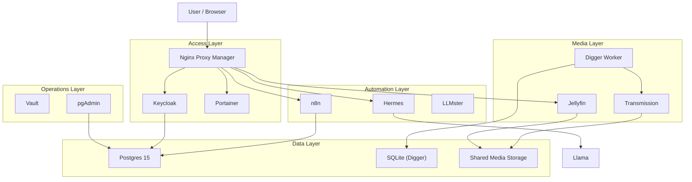
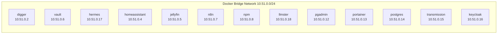
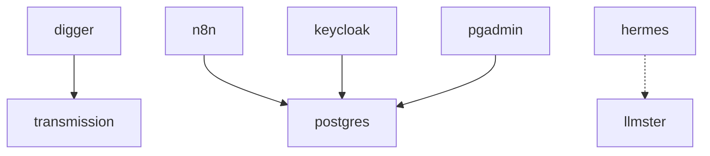
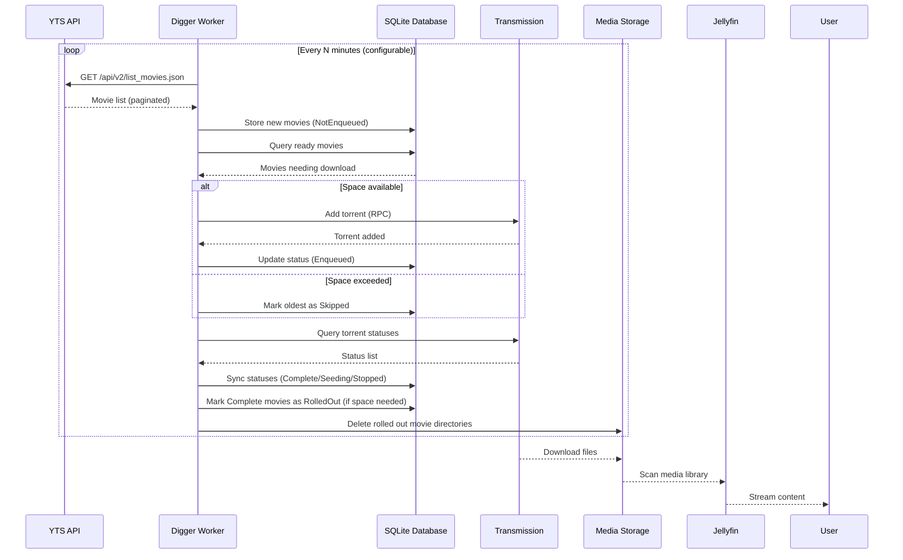
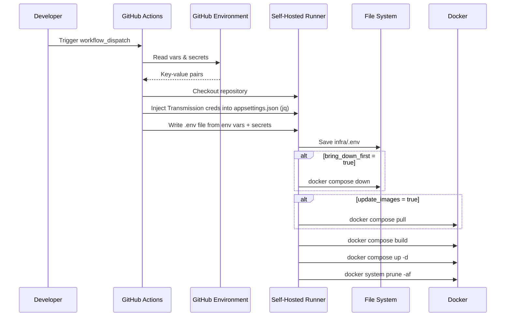

# Architecture

The home lab is designed as a cohesive system of interconnected services running on a single Docker host. This document covers the network model, storage layout, service relationships, and the end-to-end data flow.

## Contents

- [Architecture Layers](#architecture-layers)
- [Network Model](#network-model)
- [Storage Model](#storage-model)
- [Service Relationships](#service-relationships)
- [Data Flow](#data-flow)
- [Security Boundaries](#security-boundaries)

## Architecture Layers

### Access Layer

Responsible for routing external traffic, terminating TLS, and authenticating users.

- **Nginx Proxy Manager** (`10.51.0.8`): Acts as the single entry point for all web services. Handles TLS termination, virtual hosting, and access control. Exposes ports 80 (HTTP redirect), 443 (HTTPS), and 81 (admin UI).
- **Keycloak** (`10.51.0.16`): Provides OIDC-based identity and access management. Can integrate with NPM and other services for SSO. Stores configuration in the shared Postgres database.
- **Portainer** (`10.51.0.13`): Container management dashboard. Mounts the Docker socket for full management capabilities.

### Automation Layer

Handles workflow orchestration, AI inference, and background task processing.

- **n8n** (`10.51.0.7`): Advanced workflow automation platform with 400+ integrations. Backed by Postgres for persistent state. Exposed through NPM for webhook access.
- **Hermes** (`10.51.0.17`): AI agent gateway by Nous Research. Routes requests to local LLM backends. Configured with OIDC auth and resource limits (4GB RAM, 2 CPUs).
- **LLMster** (`10.51.0.18`): Local model runtime exposing the configured LM Studio model on port 4321.

### Media Layer

Manages the automated discovery, download, storage, and playback of media content.

- **Digger** (`10.51.0.2`): Custom .NET 10 worker that discovers movies from the YTS API, manages their lifecycle in SQLite, and controls Transmission for downloads. The core automation engine for the media pipeline.
- **Transmission** (`10.51.0.15`): Torrent client with RPC interface. Downloaded content lands in the shared media directory for Jellyfin consumption.
- **Jellyfin** (`10.51.0.5`): Open-source media server that organizes and streams downloaded content to users.

### Operations Layer

Infrastructure management and monitoring tools.

- **Vault** (`10.51.0.6`): HashiCorp Vault for centralized secrets management. Configured with file-based storage and a custom entrypoint.
- **pgAdmin** (`10.51.0.12`): Web-based Postgres administration tool. Pre-configured with server connection details via mounted JSON.

## Network Model

### Docker Bridge Network

All services run on a dedicated bridge network with static IP assignments in the `10.51.0.0/24` subnet.

### Port Mapping

| Host Port | Service | Purpose |
|---|---|---|
| 80 | NPM | HTTP redirect to HTTPS |
| 443 | NPM | HTTPS traffic |
| 81 | NPM | Admin UI |
| 8080 | Keycloak | Identity provider |
| 4321 | LLMster | Local model runtime endpoint |
| 5678 | n8n | Workflow editor |
| 8642 | Hermes | AI gateway |
| 9119 | Hermes | AI gateway (secondary) |
| 1234 | Vault | Secrets management |

### Inter-Service Communication

Services communicate over the internal bridge network using static IP addresses. Key communication paths:

- Digger → Transmission: RPC calls at `http://transmission:9091/transmission/rpc`
- Digger → SQLite: Local file-based access at `/digger/data/movies.db`
- n8n → Postgres: JDBC connection to `10.51.0.14:5432`
- Keycloak → Postgres: JDBC connection to `10.51.0.14:5432`
- Hermes → LLMster: HTTP inference at `http://10.51.0.18:4321`
- Jellyfin → Media: Direct file system access via mounted volumes
- Portainer → Docker: Unix socket at `/var/run/docker.sock`

## Storage Model

### Volume Mounts

The stack uses a mix of host-mounted volumes and container-local storage, organized under the home directory and a dedicated SSD mount.

| Host Path | Container Mount | Used By | Content |
|---|---|---|---|
| `~/digger` | `/digger/data` | Digger | SQLite database, worker state |
| `~/postgres/data` | `/var/lib/postgresql/data` | Postgres | Database files |
| `~/n8n` | `/home/node/.n8n` | n8n | Workflow definitions, credentials |
| `~/jellyfin/config` | `/config` | Jellyfin | Media server configuration |
| `~/jellyfin/cache` | `/cache` | Jellyfin | Metadata cache, thumbnails |
| `~/homeassistant/config` | `/config` | Home Assistant | Automation config, entities |
| `~/npm/data` | `/data` | NPM | Proxy configuration, SSL certs |
| `~/npm/certs` | `/etc/letsencrypt` | NPM | Let's Encrypt certificates |
| `~/portainer/data` | `/data` | Portainer | Container management state |
| `~/vault/config` | `/vault/config` | Vault | Server configuration |
| `~/vault/logs` | `/vault/logs` | Vault | Audit logs |
| `~/vault/file` | `/vault/file` | Vault | Encrypted secrets storage |
| `~/hermes` | `/opt/data` | Hermes | AI gateway state |
| `~/keycloak` | `/opt/keycloak/data` | Keycloak | Realm configuration |
| `~/llmster` | `/root/.lmstudio/models` | LLMster | Model cache |
| `~/pgadmin/servers.json` | `/pgadmin4/servers.json` | pgAdmin | Server connection config |
| `/mnt/ssd/transmission/downloads` | `/downloads` | Transmission | Completed downloads (shared) |
| `/mnt/ssd/transmission/incomplete` | `/incomplete` | Transmission | In-progress downloads |

### Media Storage Strategy

The media storage is physically separated from application state:

- **Application state** (`~/<service>/`): Lives on the system drive (likely an SSD or primary disk). Contains databases, config files, and metadata.
- **Media content** (`/mnt/ssd/transmission/`): Lives on a dedicated SSD mount. Contains the actual movie files shared between Transmission and Jellyfin.

This separation prevents media bloat from affecting system performance and makes it easier to manage backup strategies independently.

### Data Persistence Boundaries

| Service | Storage Type | Backup Required | Recovery Method |
|---|---|---|---|
| Postgres | Host volume (files) | Critical | SQL dump + WAL |
| SQLite (Digger) | Host volume (file) | Important | File copy |
| NPM | Host volume (files) | Important | Config export + certs |
| Home Assistant | Host volume (files) | Important | Config copy |
| Jellyfin | Host volume (files) | Moderate | Config + cache rebuild |
| Media files | Host directory | Optional | Re-downloadable |
| Portainer | Host volume (file) | Low | Re-created on deploy |

## Service Relationships

### Dependency Graph

### Hard Dependencies

Services that must be running before their dependents start:

| Dependent | Dependency | Reason |
|---|---|---|
| Digger | Transmission | RPC calls to add/check torrents |
| n8n | Postgres | Database-backed workflow state |
| Keycloak | Postgres | Database-backed realm data |
| pgAdmin | Postgres | Database administration target |

### Soft Dependencies

Services that benefit from others being available but can function independently:

| Service | Integration | Effect of Missing Integration |
|---|---|---|
| Hermes | LLMster | AI inference unavailable |
| Jellyfin | Transmission media | No new content |
| Digger | YTS API (external) | No new movie discovery |

## Data Flow

### Media Pipeline (End-to-End)

### Configuration Injection Flow (Deployment)

## Security Boundaries

### External Exposure

Only services that need external access expose host ports:

- **NPM (80, 443, 81)**: Required for web access and admin
- **Keycloak (8080)**: Identity provider endpoints
- **n8n (5678)**: Workflow webhook endpoints
- **LLMster (4321)**: Local model runtime API
- **Hermes (8642, 9119)**: AI gateway API
- **Vault (1234)**: Secrets management API

All other services are only accessible within the Docker bridge network.

### Secrets Management

- Runtime secrets (Passwords, API keys, tokens) are stored in [GitHub Environments](https://docs.github.com/en/actions/deployment/targeting-different-environments/using-environments-for-deployment)
- Secrets are injected at deploy time by the GitHub Actions workflow
- The repository itself contains zero secrets
- The `.env` file is listed in `.gitignore` and never committed
- The deployment workflow explicitly excludes `GITHUB_TOKEN` from the `.env` file
