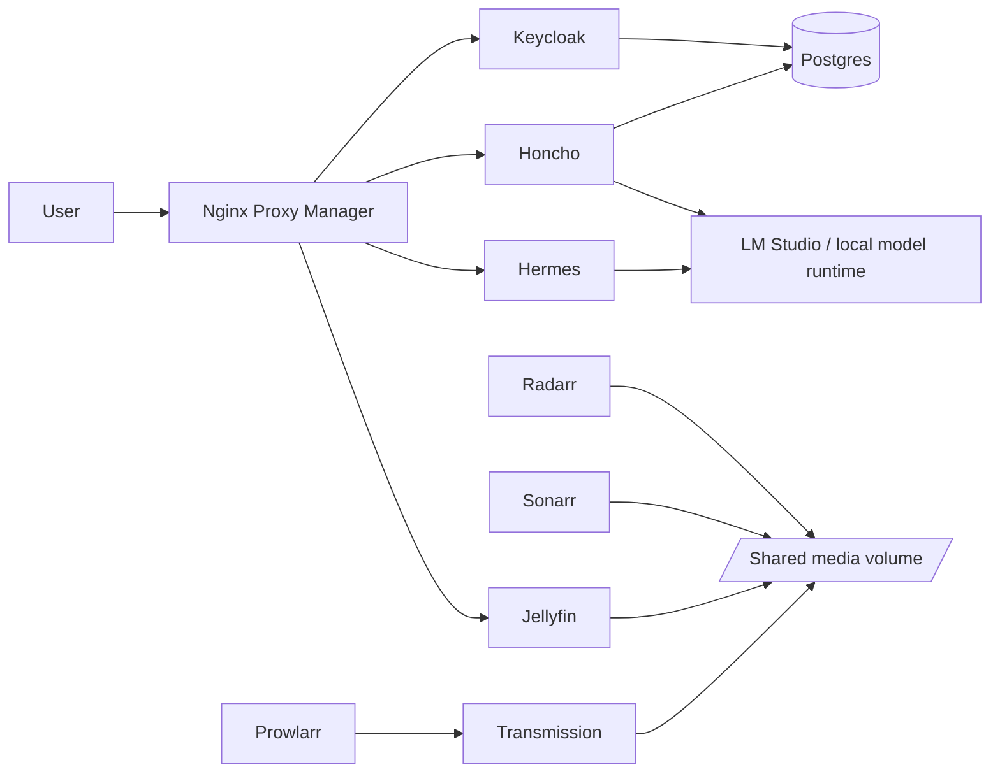

# Architecture

The repository is organised around two Docker Compose stacks that run independently but share the same host environment and a common `.env` file.

## High-level design

## Stack split

### Agentic stack

File: [../services/compose.agentic.yaml](../services/compose.agentic.yaml)

Contains:
- `hermes`
- `honcho`
- `lms`
- `keycloak`
- `postgres`
- `npm`

### Media stack

File: [../services/compose.media.yaml](../services/compose.media.yaml)

Contains:
- `prowlarr`
- `sonarr`
- `radarr`
- `transmission`
- `jellyfin`

## Build path

The project now uses:
- `images/` for Dockerfiles
- `scripts/` for entrypoint scripts
- `services/` for compose files

## Environment model

Runtime variables are supplied from a local `.env` file at the repository root. The GitHub workflow writes that file in the same location before running the compose commands.

## Validation

The repository is intentionally kept simple: the current structure is the source of truth, and old references to the previous layout should not be used anywhere in the project.
