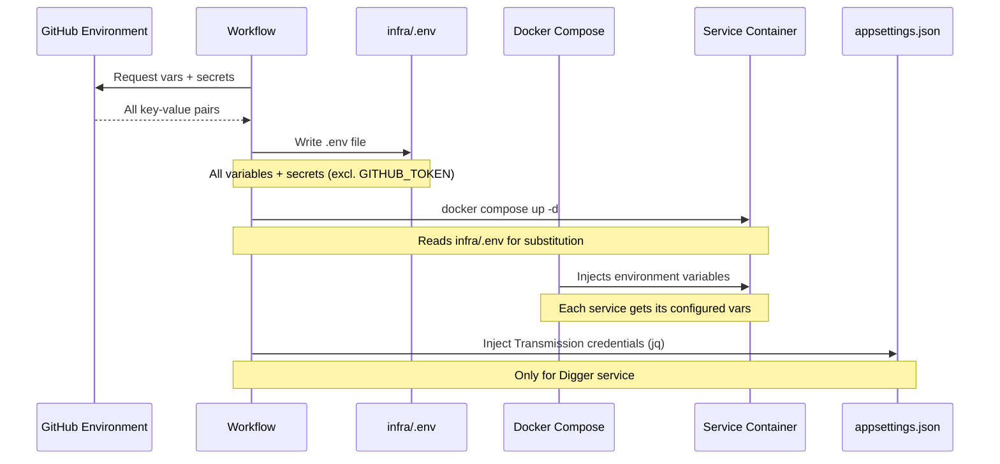

# Configuration

This document covers all configuration mechanisms used by the home lab stack.

## Contents

- [Configuration Architecture](#configuration-architecture)
- [Environment File (.env)](#environment-file-env)
- [Environment Variable Reference](#environment-variable-reference)
- [Digger appsettings.json](#digger-appsettingsjson)
- [Compose Configuration](#compose-configuration)
- [Dockerfile Configuration](#dockerfile-configuration)
- [Secrets Management](#secrets-management)
- [Configuration Flow (Deploy Time)](#configuration-flow-deploy-time)

## Configuration Architecture

The stack uses three layers of configuration:

```text
Layer 1: GitHub Environment (source of truth)
         ↓ (injected at deploy time)
Layer 2: infra/.env + appsettings.json (runtime files)
         ↓ (read by containers)
Layer 3: Docker Compose + appsettings.json (applied configuration)
```

1. **GitHub Environment**: All variables and secrets are defined in the GitHub Environment. This is the authoritative source.
2. **infra/.env**: Generated by the deployment workflow from GitHub Environment values. Used by Docker Compose for variable substitution.
3. **appsettings.json**: Used by Digger worker for its specific configuration. Transmission credentials are injected at deploy time.

## Environment File (.env)

The `.env` file is generated automatically by the deployment pipeline. It should never be committed to the repository (listed in `.gitignore`).

### How it's created

The deployment workflow merges all GitHub Environment variables and secrets into `infra/.env`:

```sh
# Variables (non-sensitive)
jq -r 'to_entries[] | select(.key != "GITHUB_TOKEN") | "\(.key)=\(.value | tostring)"' \
  <<< "$ENVIRONMENT_VARS" > infra/.env

# Secrets (sensitive values)
jq -r 'to_entries[] | select(.key != "GITHUB_TOKEN") | "\(.key)=\(.value | tostring)"' \
  <<< "$ENVIRONMENT_SECRETS" >> infra/.env
```

### Format

```
DIGGER_HOST_MOVIES_DIR=/mnt/ssd/transmission/downloads/movies
JELLYFIN_MEDIA_DIR=/mnt/ssd/transmission/downloads/media
JELLYFIN_SERVER_URL=https://jellyfin.example.com
N8N_ENCRYPTION_KEY=your-encryption-key
N8N_HOST=n8n.example.com
PGADMIN_DEFAULT_EMAIL=admin@example.com
POSTGRES_PASSWORD=your-db-password
POSTGRES_USER=postgres
TIME_ZONE=Europe/Lisbon
TRANSMISSION_DOWNLOADS_DIR=/mnt/ssd/transmission/downloads
TRANSMISSION_INCOMPLETE_DIR=/mnt/ssd/transmission/incomplete
TRANSMISSION_USERNAME=transmission
TRANSMISSION_PASSWORD=your-transmission-password
# ... additional variables as configured
```

## Environment Variable Reference

### Storage Paths

| Variable | Required | Example | Used By |
|---|---|---|---|
| `DIGGER_HOST_MOVIES_DIR` | Yes | `/mnt/ssd/transmission/downloads/movies` | Digger |
| `JELLYFIN_MEDIA_DIR` | Yes | `/mnt/ssd/transmission/downloads/media` | Jellyfin |
| `TRANSMISSION_DOWNLOADS_DIR` | Yes | `/mnt/ssd/transmission/downloads` | Transmission |
| `TRANSMISSION_INCOMPLETE_DIR` | Yes | `/mnt/ssd/transmission/incomplete` | Transmission |

### Service Credentials

| Variable | Type | Required | Default | Used By |
|---|---|---|---|---|
| `TRANSMISSION_USERNAME` | Variable | Yes | - | Transmission |
| `TRANSMISSION_PASSWORD` | Secret | Yes | - | Transmission + Digger |
| `POSTGRES_USER` | Variable | Yes | - | Postgres, n8n, Keycloak |
| `POSTGRES_PASSWORD` | Secret | Yes | - | Postgres, n8n, Keycloak, pgAdmin |

### n8n Configuration

| Variable | Type | Required | Used By |
|---|---|---|---|
| `N8N_ENCRYPTION_KEY` | Secret | Yes | n8n |
| `N8N_HOST` | Variable | Yes | n8n |

### Authentication & Identity

| Variable | Type | Required | Default | Used By |
|---|---|---|---|---|
| `KC_BOOTSTRAP_ADMIN_USERNAME` | Variable | No | `admin` | Keycloak |
| `KC_BOOTSTRAP_ADMIN_PASSWORD` | Secret | No | `admin` | Keycloak |
| `KC_HOSTNAME` | Variable | No | - | Keycloak |
| `KC_PROXY_HEADERS` | Variable | No | `xforwarded` | Keycloak |
| `KC_HTTP_ENABLED` | Variable | No | `false` | Keycloak |

### Hermes / AI

| Variable | Type | Required | Used By |
|---|---|---|---|
| `HERMES_DASHBOARD_OIDC_ISSUER` | Variable | No | Hermes |
| `HERMES_DASHBOARD_OIDC_CLIENT_ID` | Variable | No | Hermes |
| `HERMES_DASHBOARD_PUBLIC_URL` | Variable | No | Hermes |
| `OPENCODE_API_KEY` | Secret | No | Hermes |

### pgAdmin

| Variable | Type | Required | Used By |
|---|---|---|---|
| `PGADMIN_DEFAULT_EMAIL` | Variable | Yes | pgAdmin |
| `PGADMIN_DEFAULT_PASSWORD` | Secret | Yes | pgAdmin |

### General

| Variable | Required | Example | Used By |
|---|---|---|---|
| `TIME_ZONE` | Yes | `Europe/Lisbon` | All services |

## Digger appsettings.json

The Digger worker uses its own JSON configuration file at `src/Digger/Digger.Worker/appsettings.json`.

### Full Reference

```json
{
  "Logging": {
    "LogLevel": {
      "Default": "Information",
      "Microsoft.Hosting.Lifetime": "Information",
      "Microsoft.EntityFrameworkCore.Database.Command": "Error"
    }
  },
  "Transmission": {
    "ServerUrl": "http://transmission:9091/transmission/rpc",
    "User": "${TRANSMISSION_USER}",
    "Password": "${TRANSMISSION_PASSWORD}",
    "UseAuth": true
  },
  "Yts": {
    "ApiUrl": "https://movies-api.accel.li/api/v2/list_movies.json",
    "TorrentBaseUrl": "",
    "Parameters": {
      "quality": "2160p",
      "minimum_rating": "4",
      "sort_by": "year",
      "order_by": "desc",
      "limit": "50"
    },
    "YearsBack": 1,
    "Genres": [
      "action", "adventure", "comedy", "crime",
      "drama", "family", "fantasy", "film-noir",
      "horror", "musical", "mystery", "romance",
      "sci-fi", "thriller", "war", "western"
    ],
    "Languages": ["en", "pt"],
    "MinimumSeeders": 10
  },
  "StopTime": 1,
  "DownloadDirectory": "/downloads/movies",
  "ConnectionStrings": {
    "DiggerContext": "Data Source=/digger/data/movies.db"
  },
  "MaxAllocatedSpace": 750000000000,
  "MaxEnqueuedRetries": 3,
  "MaxEnqueuedTorrents": 5
}
```

### Section Details

#### Logging

| Key | Default | Description |
|---|---|---|
| `Default` | `Information` | Default log level |
| `Microsoft.Hosting.Lifetime` | `Information` | .NET host lifecycle |
| `Microsoft.EntityFrameworkCore.Database.Command` | `Error` | EF Core SQL logging |

Overridden at runtime by environment variables in compose.yaml:
- `Logging__Level__Default: Warning`
- `Logging__Level__Microsoft: Warning`

#### Transmission Section

| Key | Default | Description |
|---|---|---|
| `ServerUrl` | `http://transmission:9091/transmission/rpc` | Transmission RPC endpoint |
| `User` | (injected at deploy) | RPC username |
| `Password` | (injected at deploy) | RPC password |
| `UseAuth` | `true` | Enable authentication |

#### YTS Section

| Key | Default | Description |
|---|---|---|
| `ApiUrl` | `https://movies-api.accel.li/api/v2/list_movies.json` | YTS API endpoint |
| `TorrentBaseUrl` | (empty) | Base URL for torrent download paths |
| `Parameters.quality` | `2160p` | Quality filter |
| `Parameters.minimum_rating` | `4` | Minimum IMDB rating |
| `Parameters.sort_by` | `year` | Sort field |
| `Parameters.order_by` | `desc` | Sort direction |
| `Parameters.limit` | `50` | Results per page |
| `YearsBack` | `1` | Max years to search |
| `Genres` | 16 genres | Included genres |
| `Languages` | `["en", "pt"]` | Included languages |
| `MinimumSeeders` | `10` | Minimum seeder count |

#### Worker Section

| Key | Default | Unit | Description |
|---|---|---|---|
| `StopTime` | `1` | Minutes | Pause between worker cycles |
| `DownloadDirectory` | `/downloads/movies` | Path | Where movies are saved |
| `MaxAllocatedSpace` | `750000000000` | Bytes (750 GB) | Max space for queued downloads |
| `MaxEnqueuedRetries` | `3` | Count | Max download attempts per movie |
| `MaxEnqueuedTorrents` | `5` | Count | Max concurrent downloads |

#### Connection Strings

| Key | Value | Description |
|---|---|---|
| `DiggerContext` | `Data Source=/digger/data/movies.db` | SQLite database path |

## Compose Configuration

The Docker Compose file itself contains hardcoded defaults and variable references:

### Service-Level Variables

Variables referenced in `infra/compose.yaml` with the `${VAR_NAME}` syntax must be present in `infra/.env` at runtime.

**Services with variable references:**
- **jellyfin**: `${JELLYFIN_SERVER_URL}`, `${JELLYFIN_MEDIA_DIR}`
- **n8n**: `${N8N_ENCRYPTION_KEY}`, `${TIME_ZONE}`, `${N8N_HOST}`, `${POSTGRES_USER}`, `${POSTGRES_PASSWORD}`
- **npm**: `${TIME_ZONE}`
- **homeassistant**: (none; uses fixed paths)
- **hermes**: `${HERMES_DASHBOARD_OIDC_ISSUER}`, `${HERMES_DASHBOARD_OIDC_CLIENT_ID}`, `${HERMES_DASHBOARD_PUBLIC_URL}`, `${OPENCODE_API_KEY}`
- **transmission**: `${TRANSMISSION_USERNAME}`, `${TRANSMISSION_PASSWORD}`, `${TRANSMISSION_DOWNLOADS_DIR}`, `${TRANSMISSION_INCOMPLETE_DIR}`
- **keycloak**: `${KC_HOSTNAME}`, `${POSTGRES_USER}`, `${POSTGRES_PASSWORD}`
- **pgadmin**: `${PGADMIN_DEFAULT_EMAIL}`, `${PGADMIN_DEFAULT_PASSWORD}`
- **postgres**: `${POSTGRES_USER}`, `${POSTGRES_PASSWORD}`
- **digger**: `${DIGGER_HOST_MOVIES_DIR}`

### Variable Substitution

Docker Compose performs variable substitution from the `.env` file in the `infra/` directory. The workflow explicitly specifies:

```sh
docker compose --env-file infra/.env -f infra/compose.yaml up -d
```

### Services with Default Values

Keycloak provides defaults for some variables directly in the compose file using the `:-` syntax:

```yaml
KC_BOOTSTRAP_ADMIN_USERNAME: ${KC_BOOTSTRAP_ADMIN_USERNAME:-admin}
KC_BOOTSTRAP_ADMIN_PASSWORD: ${KC_BOOTSTRAP_ADMIN_PASSWORD:-admin}
KC_PROXY_HEADERS: ${KC_PROXY_HEADERS:-xforwarded}
KC_HTTP_ENABLED: ${KC_HTTP_ENABLED:-false}
```

## Dockerfile Configuration

### transmission (Dockerfile.transmission)

```dockerfile
ENV TRANSMISSION_USER="transmission" \
    TRANSMISSION_PASSWORD="transmission" \
    TRANSMISSION_ALLOWED="*"
```

These are build-time defaults. Runtime values are set via environment variables from `compose.yaml`.

### llama (Dockerfile.llama)

Entrypoint is hardcoded to serve the Ministral-3-3B-Reasoning model. To change the model, modify the Dockerfile or override the entrypoint.

### digger (Dockerfile.digger)

Build-time only. No runtime configuration through Dockerfile. Uses `appsettings.json` and environment overrides.

## Secrets Management

### Principles

1. **Never commit secrets**: The repository contains no passwords, tokens, or API keys
2. **GitHub Environments as source of truth**: All secrets are defined in GitHub Environment settings
3. **Injection at deploy time**: Secrets are written to `.env` and `appsettings.json` during deployment
4. **Isolation**: Each environment has its own set of secrets, enabling different configurations for different machines

### What's a Secret vs Variable

GitHub distinguishes between:
- **Variables** (`vars`): Non-sensitive values that can be read in workflow logs (usernames, hostnames, paths)
- **Secrets** (`secrets`): Sensitive values masked in logs (passwords, API keys, tokens)

In the home lab:
- **Variables**: `POSTGRES_USER`, `N8N_HOST`, `TIME_ZONE`, `TRANSMISSION_USERNAME`, storage paths
- **Secrets**: `POSTGRES_PASSWORD`, `N8N_ENCRYPTION_KEY`, `TRANSMISSION_PASSWORD`, `OPENCODE_API_KEY`

### Transmission Password Flow

The Transmission password follows a specific path:

1. **GitHub Environment**: Stored as a secret named `TRANSMISSION_PASSWORD`
2. **Workflow step "Redact configurations"**: Injects into `appsettings.json`
3. **Workflow step "Create .env file"**: Writes to `infra/.env` as `TRANSMISSION_PASSWORD`
4. **Compose**: Set as environment variable on the `transmission` container
5. **Transmission daemon**: Reads `$TRANSMISSION_PASSWORD` from environment

### Adding a New Secret

1. Go to GitHub: **Settings > Environments > [environment name]**
2. Click **Add secret**
3. Enter the name (uppercase, underscore-separated)
4. Enter the value
5. Reference it in the compose file with `${SECRET_NAME}`
6. Ensure it's added to the environment variable list in this documentation

### Rotating Secrets

1. Update the value in GitHub Environment settings
2. Trigger a new deployment
3. The old values will be overwritten in the `.env` file and `appsettings.json`
4. Running containers will need to be recreated (use `bring_down_first`)

## Configuration Flow (Deploy Time)



### Local Override (Development)

For local development without the deployment pipeline:

```sh
# Copy and edit the environment file
cp infra/.env.example infra/.env

# Edit with your values
nano infra/.env

# Start manually
docker compose --env-file infra/.env -f infra/compose.yaml up -d
```

> **Warning**: Never commit `infra/.env` to the repository.
