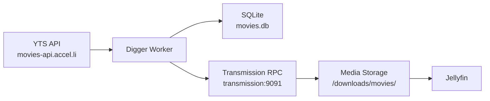
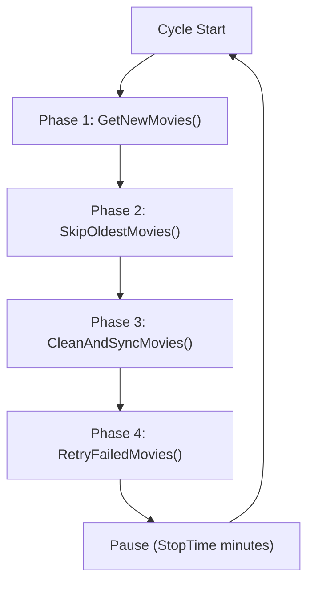

# Digger Worker

Digger is a custom .NET 10 worker service that automates the discovery, download, lifecycle management, and cleanup of movie content. It bridges the YTS movie API and Transmission torrent client, maintaining state in a SQLite database.

## Contents

- [Overview](#overview)
- [Architecture](#architecture)
- [Movie Lifecycle](#movie-lifecycle)
- [Worker Cycle (4 Phases)](#worker-cycle-4-phases)
- [Cleaner Service](#cleaner-service)
- [Configuration Reference](#configuration-reference)
- [Database Schema](#database-schema)
- [API Integrations](#api-integrations)
- [Deployment](#deployment)
- [Troubleshooting](#troubleshooting)

## Overview



Digger runs as an infinite-loop background service with configurable pause intervals. Each cycle performs four phases: discovery, capacity management, synchronization, and retry.

### Key Capabilities

- **Movie Discovery**: Fetches movies from YTS API filtered by genre, language, year, quality, and minimum seeders
- **Capacity Management**: Enforces disk space limits by skipping or removing old content
- **Lifecycle Tracking**: Maintains 13 distinct states for each movie through its lifecycle
- **Transmission Integration**: Adds torrents and monitors download progress via RPC
- **Automatic Cleanup**: Removes completed movies from disk when space is needed
- **Built-in Retry**: Re-attempts failed downloads up to configurable limit

## Architecture

### Project Structure

```text
src/Digger/
├── Digger.slnx                              # Solution file
├── Digger.Worker/                           # Entry point + background services
│   ├── Program.cs                           # DI registration, host builder
│   ├── Worker.cs                            # Main worker (4-phase cycle)
│   ├── Cleaner.cs                           # Rolled-out movie file cleanup
│   ├── appsettings.json                     # All runtime configuration
│   └── Digger.Worker.csproj                 # Project file (net10.0)
├── Digger.Services/                         # Business logic
│   ├── Contracts/
│   │   ├── IYtsService.cs                   # YTS API contract
│   │   └── ITransmissionService.cs          # Transmission RPC contract
│   └── Implementations/
│       ├── YtsService.cs                    # YTS HTTP client implementation
│       └── TransmissionService.cs           # Transmission RPC client implementation
├── Digger.Services.Models/                  # API DTOs
│   └── Yts/
│       ├── YtsResponse.cs                   # Top-level API response
│       ├── Data.cs                          # Data wrapper
│       ├── Meta.cs                          # API metadata
│       ├── Movie.cs                         # YTS movie model (56 fields)
│       ├── Torrent.cs                       # Torrent model (15 fields)
│       └── YtsMovieModel.cs                 # Internal normalized movie model
├── Digger.Data/                             # Persistence layer
│   ├── Context/
│   │   └── DiggerContext.cs                 # EF Core DbContext (SQLite)
│   └── Entities/
│       └── Movie.cs                         # Database entity
└── Digger.Data.Common/                      # Shared types
    └── Enums/
        └── MovieStatus.cs                   # 13 lifecycle statuses
```

### Dependency Injection

Registered in `Program.cs` as singletons:

| Service | Implementation | Lifetime |
|---|---|---|
| `Worker` | Background service | Singleton (hosted) |
| `Cleaner` | Background service | Singleton (hosted) |
| `DiggerContext` | EF Core DbContext | Singleton |
| `IYtsService` | `YtsService` | Singleton |
| `ITransmissionService` | `TransmissionService` | Singleton |

### Build Process

The `dockerfile.digger` uses a multi-stage build:

1. **SDK stage**: `mcr.microsoft.com/dotnet/sdk:10.0`
2. Copies entire source tree
3. Publishes `Digger.Worker.csproj` to `/digger`
4. Removes source tree (keeps only published output)
5. Entrypoint: `dotnet /digger/Digger.Worker.dll`

## Movie Lifecycle

Each movie tracked by Digger passes through a state machine with 13 possible statuses.

### Status Definitions

```csharp
public enum MovieStatus
{
    Stopped,          // 0  - Torrent stopped by user
    PendingCheck,     // 1  - Awaiting hash check
    Checking,         // 2  - Hash check in progress
    PendingDownload,  // 3  - Awaiting download
    Downloading,      // 4  - Actively downloading
    PendingSeed,      // 5  - Download complete, seeding
    Seeding,          // 6  - Actively seeding
    NotEnqueued,      // 7  - Discovered, ready to download
    Enqueued,         // 8  - Sent to Transmission
    Failed,           // 9  - All download attempts exhausted
    RolledOut,        // 10 - Deleted from disk to free space
    Complete,         // 11 - Downloaded and confirmed
    Skipped           // 12 - Skipped due to capacity limits
}
```

### State Transitions

```mermaid
flowchart TD
    Start["(external)"] --> NotEnqueued
    
    NotEnqueued --> Enqueued
    NotEnqueued --> Skipped
    
    Enqueued --> Downloading
    Enqueued --> Failed
    
    Downloading --> Seeding
    Downloading --> Stopped
    
    Seeding --> Complete
    
    Complete --> RolledOut
    
    Stopped --> NotEnqueued
    Failed --> NotEnqueued
    
    RolledOut --> "(deleted from disk)"
    Skipped --> "(no further action)"
```

### Lifecycle in Detail

1. **Discovery**: YTS API returns movies → stored as `NotEnqueued`
2. **Capacity Check**: If total `NotEnqueued` size exceeds `MaxAllocatedSpace`, oldest movies are marked `Skipped`
3. **Enqueue**: Movies are sent to Transmission → status changes to `Enqueued`
4. **Download**: Transmission downloads → Digger queries status and updates to `Seeding` or `Stopped`
5. **Completion**: Seeding torrents → `Complete`
6. **Rollout**: If space is needed, oldest `Complete` movies are deleted from disk and marked `RolledOut`
7. **Cleanup**: The Cleaner service verifies `RolledOut` movies no longer exist on disk
8. **Retry**: `Failed` movies are reset to `NotEnqueued` for re-processing (up to `MaxEnqueuedRetries` times)

## Worker Cycle (4 Phases)

The `Worker` background service runs four phases in sequence, then pauses for `StopTime` minutes.



### Phase 1: GetNewMovies

**Purpose**: Discover new movies from YTS API that match configured filters.

**Process**:
1. Constructs API URL with configured parameters (quality, sort order, minimum rating)
2. Iterates through paginated results
3. For each movie on each page:
   - Checks language matches configured languages (en, pt)
   - Checks release year is within configured `YearsBack`
   - Checks genre intersects with configured genre list
4. For qualifying movies, finds best torrent (highest seeds, matching quality)
5. Stores new movies in SQLite with status `NotEnqueued`
6. Continues pagination until a page has no movies from within the configured year range

**Configuration affecting this phase**:
| Setting | Effect |
|---|---|
| `Yts:Parameters:quality` | Target quality (e.g., `2160p`) |
| `Yts:Parameters:limit` | Movies per page (50) |
| `Yts:YearsBack` | How far back to check (1 year) |
| `Yts:Genres` | Included genres (16 film genres) |
| `Yts:Languages` | Included languages (`en`, `pt`) |
| `Yts:MinimumSeeders` | Minimum seeder threshold (10) |
| `Yts:Parameters:minimum_rating` | Minimum rating filter (4) |

### Phase 2: SkipOldestMovies

**Purpose**: Enforce disk space limits by skipping movies when capacity is exceeded.

**Process**:
1. Queries all `NotEnqueued` movies sorted by `PublishDate` descending
2. Calculates total size of all `NotEnqueued` movies
3. If total size > `MaxAllocatedSpace`:
   - Finds the boundary point where the newest movies fit within the limit
   - Marks movies beyond the boundary as `Skipped`

**Configuration affecting this phase**:
| Setting | Effect |
|---|---|
| `MaxAllocatedSpace` | Maximum bytes allocated (750GB default) |

### Phase 3: CleanAndSyncMovies

**Purpose**: The most complex phase. Syncs Transmission state, rolls out old movies, and enqueues new downloads.

**Process** (in order):

1. **Sync completed torrents**:
   - Queries Transmission for torrents with status `Seeding` or `PendingSeed`
   - Removes those torrents from Transmission
   - Marks corresponding movies in SQLite as `Complete`

2. **Handle stopped/failed torrents**:
   - Queries Transmission for stopped torrents (status 0)
   - Removes those torrents from Transmission
   - Increments `DownloadAttempt` for corresponding movies
   - If `DownloadAttempt >= MaxEnqueuedRetries`, marks as `Failed`
   - Otherwise, resets to `NotEnqueued` for retry

3. **Roll out completed movies** (if space needed):
   - Calculates current allocated space (sum of sizes for active/enqueued/seeding/complete/pending states)
   - Calculates space needed for new downloads
   - If insufficient space, rolls out oldest `Complete` movies:
     - Deletes directory from disk
     - Marks as `RolledOut`

4. **Enqueue new torrents**:
   - Calculates available slots: `MaxEnqueuedTorrents - currentDownloadsCount`
   - Selects oldest `NotEnqueued` movies to fill slots
   - For each movie: calls Transmission RPC to add torrent, marks as `Enqueued`
   - On failure: marks as `Failed`

**Configuration affecting this phase**:
| Setting | Effect |
|---|---|
| `MaxEnqueuedTorrents` | Maximum concurrent downloads (5) |
| `MaxEnqueuedRetries` | Maximum download attempts (3) |
| `MaxAllocatedSpace` | Space enforcement boundary (750GB) |

### Phase 4: RetryFailedMovies

**Purpose**: Reset failed movies for re-processing.

**Process**:
1. Queries all movies with status `Failed`
2. Resets them to `NotEnqueued`
3. Saves changes

**Effect**: Failed movies will be re-processed in Phase 3 of the next cycle.

## Cleaner Service

A separate background service that runs every 5 minutes to ensure `RolledOut` movies are actually removed from disk.

**Process**:
1. Queries SQLite for all movies with status `RolledOut`
2. Lists all directories in `/downloads/movies`
3. Finds intersection: `RolledOut` movies that still exist on disk
4. Deletes those directories
5. Logs all deletions

This is a safety net for cases where Phase 3's deletion fails or is interrupted.

## Configuration Reference

All configuration lives in `src/Digger/Digger.Worker/appsettings.json`.

### Transmission Section

```json
{
  "Transmission": {
    "ServerUrl": "http://transmission:9091/transmission/rpc",
    "User": "${TRANSMISSION_USER}",
    "Password": "${TRANSMISSION_PASSWORD}",
    "UseAuth": true
  }
}
```

| Field | Description | Default |
|---|---|---|
| `ServerUrl` | Transmission RPC endpoint | `http://transmission:9091/transmission/rpc` |
| `User` | RPC username | Injected at deploy time |
| `Password` | RPC password | Injected at deploy time |
| `UseAuth` | Enable authentication | `true` |

### YTS Section

```json
{
  "Yts": {
    "ApiUrl": "https://movies-api.accel.li/api/v2/list_movies.json",
    "TorrentBaseUrl": "",
    "Parameters": {
      "quality": "2160p",
      "minimum_rating": "4",
      "sort_by": "year",
      "order_by": "desc",
      "limit": "50"
    },
    "YearsBack": 1,
    "Genres": ["action", "adventure", "comedy", "crime", ...],
    "Languages": ["en", "pt"],
    "MinimumSeeders": 10
  }
}
```

| Field | Description | Default |
|---|---|---|
| `ApiUrl` | YTS API endpoint | `https://movies-api.accel.li/api/v2/list_movies.json` |
| `TorrentBaseUrl` | Base URL prepended to torrent paths | (empty) |
| `Parameters:quality` | Target video quality | `2160p` |
| `Parameters:minimum_rating` | Minimum IMDB rating | `4` |
| `Parameters:sort_by` | API sort field | `year` |
| `Parameters:order_by` | Sort direction | `desc` |
| `Parameters:limit` | Results per page | `50` |
| `YearsBack` | Max years back to search | `1` |
| `Genres` | Included genres | 16 genres |
| `Languages` | Included languages | `en`, `pt` |
| `MinimumSeeders` | Minimum seeder count | `10` |

### Worker Section

```json
{
  "StopTime": 1,
  "DownloadDirectory": "/downloads/movies",
  "MaxAllocatedSpace": 750000000000,
  "MaxEnqueuedRetries": 3,
  "MaxEnqueuedTorrents": 5
}
```

| Field | Description | Default | Unit |
|---|---|---|---|
| `StopTime` | Pause between cycles | `1` | Minutes |
| `DownloadDirectory` | Movie download path | `/downloads/movies` | Path |
| `MaxAllocatedSpace` | Max space for downloads | `750000000000` | Bytes (750GB) |
| `MaxEnqueuedRetries` | Max download attempts | `3` | Count |
| `MaxEnqueuedTorrents` | Max concurrent downloads | `5` | Count |

### Database Section

```json
{
  "ConnectionStrings": {
    "DiggerContext": "Data Source=/digger/data/movies.db"
  }
}
```

## Database Schema

### Movies Table

| Column | Type | Nullable | Default | Description |
|---|---|---|---|---|
| `Id` | INTEGER (PK) | No | - | YTS movie ID |
| `Name` | TEXT | No | - | English title |
| `Path` | TEXT | No | - | Download path on disk |
| `TorrentUrl` | TEXT | No | - | Torrent file URL |
| `Timestamp` | TEXT (DateTime) | No | - | Record creation time |
| `DownloadAttempt` | INTEGER | No | `1` | Current attempt count |
| `LastKnownStatus` | TEXT | No | - | Serialized MovieStatus |
| `Size` | INTEGER | No | - | Size in bytes |
| `PublishDate` | TEXT (DateTime) | No | - | YTS upload date |

### Example Record

```json
{
  "Id": 12345,
  "Name": "Inception",
  "Path": "/downloads/movies/Inception",
  "TorrentUrl": "https://yts.mx/torrent/download/...",
  "Timestamp": "2026-07-15T10:30:00Z",
  "DownloadAttempt": 1,
  "LastKnownStatus": "NotEnqueued",
  "Size": 15728640000,
  "PublishDate": "2026-07-14T00:00:00Z"
}
```

## API Integrations

### YTS API

- **Endpoint**: `https://movies-api.accel.li/api/v2/list_movies.json`
- **Method**: GET
- **Authentication**: None
- **Rate Limiting**: Not documented; paginated with `limit` parameter

**Request Parameters**:
| Parameter | Value | Description |
|---|---|---|
| `quality` | `2160p` | Filter by quality |
| `minimum_rating` | `4` | Minimum IMDB rating |
| `sort_by` | `year` | Sort movies by year |
| `order_by` | `desc` | Newest first |
| `limit` | `50` | Movies per page |
| `page` | `1..N` | Page number (set dynamically) |

**Response Shape** (abbreviated):
```json
{
  "status": "ok",
  "status_message": "Query was successful",
  "data": {
    "movie_count": 1000,
    "limit": 50,
    "page_number": 1,
    "movies": [
      {
        "id": 12345,
        "url": "https://yts.mx/movies/inception-2010",
        "title": "Inception (2010)",
        "title_english": "Inception",
        "year": 2010,
        "rating": 8.8,
        "genres": ["Action", "Sci-Fi", "Thriller"],
        "language": "en",
        "torrents": [
          {
            "url": "/torrent/download/...",
            "hash": "...",
            "quality": "2160p",
            "seeds": 500,
            "peers": 100,
            "size_bytes": 15728640000,
            "date_uploaded": "2026-01-01 00:00:00"
          }
        ]
      }
    ]
  }
}
```

### Transmission RPC

- **Endpoint**: `http://transmission:9091/transmission/rpc`
- **Authentication**: Basic auth (configurable)
- **Library**: `Transmission.API.RPC` (NuGet package)
- **Protocol**: JSON-RPC over HTTP

**Operations Used**:

| Operation | Method | Purpose |
|---|---|---|
| `torrent-add` | `TorrentAdd()` | Add new download |
| `torrent-get` | `TorrentGet()` | Get all torrents with all fields |
| `torrent-remove` | `TorrentRemove()` | Remove completed/failed torrents |

**Status Mapping** (Transmission → MovieStatus):
| Transmission Status | Value | Mapped To |
|---|---|---|
| `TR_STATUS_STOPPED` | 0 | `Stopped` |
| `TR_STATUS_CHECK_WAIT` | 1 | `PendingCheck` |
| `TR_STATUS_CHECK` | 2 | `Checking` |
| `TR_STATUS_DOWNLOAD_WAIT` | 3 | `PendingDownload` |
| `TR_STATUS_DOWNLOAD` | 4 | `Downloading` |
| `TR_STATUS_SEED_WAIT` | 5 | `PendingSeed` |
| `TR_STATUS_SEED` | 6 | `Seeding` |

## Deployment

### Build Artifact

The Digger is built as part of the Docker Compose stack. The `dockerfile.digger` compiles the .NET 10 worker into a self-contained deployment.

### Runtime Secret Injection

The deployment workflow uses `jq` to inject Transmission credentials into `appsettings.json` before starting the container:

```sh
jq \
  --arg transmissionUsername "$TRANSMISSION_USERNAME" \
  --arg transmissionPassword "$TRANSMISSION_PASSWORD" \
  'setpath(["Transmission", "User"]; $transmissionUsername)
   | setpath(["Transmission", "Password"]; $transmissionPassword)' \
  appsettings.json > appsettings_tmp.json
```

### Local Development

```sh
# Run without Docker
cd src/Digger
dotnet run --project Digger.Worker

# Build
dotnet build src/Digger/Digger.slnx

# Publish
dotnet publish src/Digger/Digger.Worker/Digger.Worker.csproj -o out/
```

## Troubleshooting

### Common Issues

| Symptom | Likely Cause | Resolution |
|---|---|---|
| No new movies discovered | YTS API unreachable or filters too restrictive | Check API URL, expand genre/language/year filters |
| Downloads stuck at `Enqueued` | Transmission unreachable or auth wrong | Verify `Transmission:ServerUrl`, check credentials |
| Movies marked `Failed` repeatedly | Torrent has no seeders or disk full | Increase `MinimumSeeders`, free disk space |
| `Skipped` movies growing rapidly | `MaxAllocatedSpace` too low | Increase allocation or add more disk |
| Worker not cycling | `StopTime` too high | Reduce `StopTime` value (in minutes) |
| SQLite errors | Database file locked/corrupt | Check file permissions, restore from backup |
| RolledOut movies reappearing | Cleaner and Worker race condition | Normal; Cleaner will catch them in next cycle |

### Logging

Log levels are configured via environment variables in the compose file:

| Variable | Default | Effect |
|---|---|---|
| `Logging__Level__Default` | `Warning` | General log level |
| `Logging__Level__Microsoft` | `Warning` | .NET framework logs |
| `Logging__LogLevel__Microsoft_Hosting_Lifetime` | `Warning` | Host lifetime events |
| `Logging__LogLevel__Microsoft__EntityFrameworkCore__Database__Command` | `Error` | SQL command logging |

Set to `Information` or `Debug` for more verbose output during troubleshooting.

### Monitoring Commands

```sh
# View worker logs
docker logs -f digger

# Check SQLite database
docker exec digger sqlite3 /digger/data/movies.db "SELECT COUNT(*), LastKnownStatus FROM Movies GROUP BY LastKnownStatus;"

# Check Transmission status
curl -u user:pass http://transmission:9091/transmission/rpc -d '{"method":"session-stats"}'

# Check current download directory size
docker exec digger du -sh /downloads/movies
```
