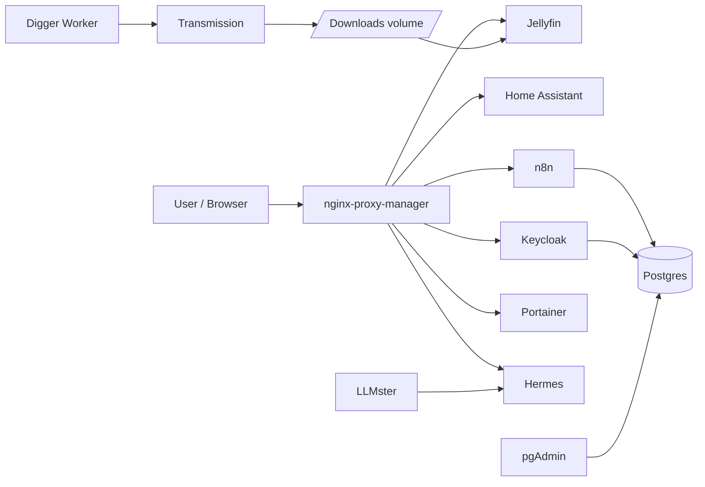
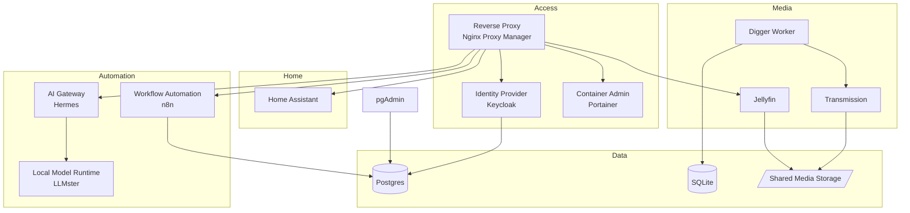
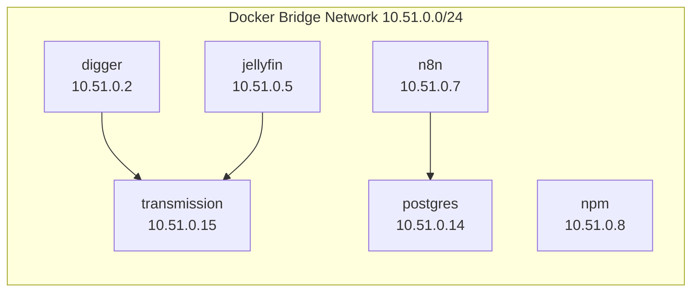
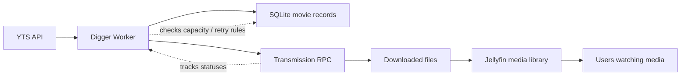
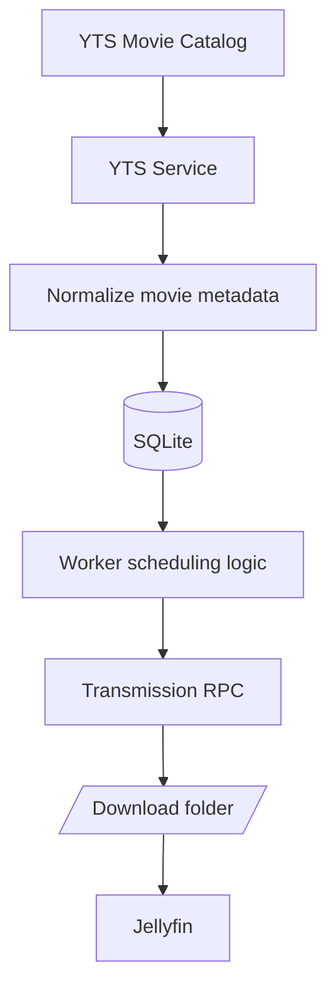
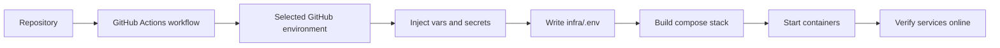

# 🏠 Home Lab

This repository defines a self-hosted home-lab environment that combines media serving, automation, identity, networking, monitoring, and content-processing services on a single Docker host. The goal is not just to run containers, but to connect them so that the stack behaves like a cohesive system: users access services through a reverse proxy, automation tools run in the background, media is downloaded and consumed automatically, and operational tools help manage everything.

The most important idea is that the stack is a networked home platform, not just a list of individual apps. The services interact through shared volumes, internal Docker networking, and deployment automation.

> **Full documentation available in [`docs/`](docs/index.md)** — covers architecture, all services, the Digger worker, deployment pipeline, configuration, operations, and utility scripts.

---

## Table of Contents

- [1. Home-Lab Overview](#1-home-lab-overview)
- [2. Repository Layout](#2-repository-layout)
- [3. Service Relationships](#3-service-relationships)
- [4. Runtime Network and Storage Model](#4-runtime-network-and-storage-model)
- [5. Media and Automation Flow](#5-media-and-automation-flow)
- [6. Configuration and Secrets](#6-configuration-and-secrets)
- [7. Digger in the Bigger Picture](#7-digger-in-the-bigger-picture)
- [8. Deployment Pipeline](#8-deployment-pipeline)
- [9. Local Operations](#9-local-operations)
- [10. Backup and Maintenance](#10-backup-and-maintenance)

---

## 1. Home-Lab Overview

This repository is best understood as a home automation and media platform with several layers:

- **Access layer**: reverse proxy, identity, and dashboard services
- **Automation layer**: workflows, AI tooling, and background jobs
- **Media layer**: torrenting, storage, and playback services
- **Operations layer**: deployment automation, container management, and monitoring tools

### High-level architecture



This diagram shows the main idea: the home lab is an ecosystem where user-facing services are exposed through a central proxy, while background workers and storage services support the media and automation workloads.

---

## 2. Repository Layout

```text
.
├── .github/
│   └── workflows/
│       └── publish-home-lab.yaml
├── infra/
│   ├── compose.yaml
│   ├── digger/
│   │   └── Dockerfile
│   └── transmission/
│       └── Dockerfile
├── scripts/
│   ├── externals/
│   │   ├── deepwiki-open.sh
│   │   ├── honcho.entrypoint.sh
│   │   └── lmstudio.entrypoint.sh
│   └── utils/
│       └── copy-env-vars.sh
└── src/
    └── Digger/
        ├── Digger.Data/
        ├── Digger.Data.Common/
        ├── Digger.Services/
        ├── Digger.Services.Models/
        └── Digger.Worker/
```

### What each area is responsible for

- `.github/workflows/` contains the deployment logic for bringing the stack online on a self-hosted runner.
- `infra/` defines the containers, networking, and startup configuration for every service.
- `scripts/` contains utility automation, environment synchronization helpers, and the Honcho / LM Studio entrypoint scripts used by the container images.
- `src/Digger/` contains the worker code that discovers and manages movie content.

---

## 3. Service Relationships

The services are designed to work together, not separately. The following diagram shows how the most important components connect.



### Relationship notes

- `NPM` is the primary facade for the stack. It is the front door for many services.
- `Keycloak` and `n8n` both rely on `Postgres` for persistence.
- `Jellyfin` consumes the media downloaded by `Transmission`.
- `Digger` is the automation bridge between external movie discovery and local media storage.
- `Hermes` and the local model runtime provide local AI capabilities that can be used by the broader stack.

---

## 4. Runtime Network and Storage Model

The compose definition uses a dedicated bridge network with static IPs so services can reliably locate one another.



### Storage layout

The stack depends on both container-local and host-mounted storage:

- `~/digger` for the Digger SQLite database and state
- `~/postgres/data` for database persistence
- `~/n8n` for workflow state
- `~/jellyfin/config` and `~/jellyfin/cache` for media server metadata
- `~/homeassistant/config` for automation configuration
- `/mnt/ssd/transmission/downloads` and `/mnt/ssd/transmission/incomplete` for torrent content

This separation is important because it keeps application state, media storage, and service configuration distinct.

---

## 5. Media and Automation Flow

The main end-to-end flow is a combination of discovery, download, storage, and consumption.



### What happens in practice

1. `Digger` asks YTS for new movie candidates.
2. It records the metadata and intended download locations in SQLite.
3. If there is space and the queue is under limit, it adds torrents to Transmission.
4. Transmission downloads content into the shared media directory.
5. Jellyfin can read the downloaded content and present it to users.
6. If content is old or space is constrained, the worker can roll out or skip entries.

---

## 6. Configuration and Secrets

The stack uses two important configuration layers:

1. **Docker runtime values** from `infra/.env`
2. **Worker settings** from `src/Digger/Digger.Worker/appsettings.json`

### Environment values used by the compose stack

- `JELLYFIN_SERVER_URL`
- `N8N_ENCRYPTION_KEY`
- `POSTGRES_PASSWORD`
- `POSTGRES_USER`
- `TRANSMISSION_PASSWORD`
- `TRANSMISSION_USER` (optional)
- additional values for optional services such as Keycloak and pgAdmin

### Runtime settings used by the worker

| Setting | Example value | Why it matters |
| --- | --- | --- |
| `Transmission:ServerUrl` | `http://transmission:9091/transmission/rpc` | Lets the worker talk to the containerized Transmission service |
| `Transmission:UseAuth` | `true` | Ensures the RPC interface is protected |
| `StopTime` | `1` | Controls how often the worker cycles |
| `MaxEnqueuedTorrents` | `5` | Caps concurrent downloads |
| `MaxAllocatedSpace` | `750000000000` | Limits how much disk the queue can claim |
| `ConnectionStrings:DiggerContext` | `Data Source=/digger/data/movies.db` | Points the worker at its SQLite database |

The deployment workflow injects secrets into the worker configuration at runtime so the repository itself does not contain sensitive values.

---

## 7. Digger in the Bigger Picture

`Digger` is one piece of the home lab, but it is the component that ties discovery, media, and storage together.



### Why Digger matters

- It automates the intake of new content.
- It keeps the media queue within configured limits.
- It tracks the lifecycle of each movie through discovery, download, seeding, and cleanup.
- It protects the home lab from uncontrolled disk usage.

In other words, Digger is the automation engine that keeps the media side of the home lab manageable.

---

## 8. Deployment Pipeline

The deployment flow is handled by GitHub Actions and is designed to turn repository inputs into a running local stack.



### What the workflow does

1. selects the environment to deploy to;
2. updates Transmission credentials in the worker settings;
3. writes runtime values into `infra/.env`;
4. optionally brings existing services down;
5. pulls or builds images;
6. starts the stack with Docker Compose;
7. removes dangling images to reclaim space.

This makes deployments repeatable and keeps sensitive runtime values outside the repository.

---

## 9. Local Operations

### Start the stack

```sh
docker compose --env-file infra/.env -f infra/compose.yaml up -d
```

### Check service status

```sh
docker compose --env-file infra/.env -f infra/compose.yaml ps
```

### Read container logs

```sh
docker compose --env-file infra/.env -f infra/compose.yaml logs -f transmission
```

### Stop everything

```sh
docker compose --env-file infra/.env -f infra/compose.yaml down
```

### Update images

```sh
docker compose --env-file infra/.env -f infra/compose.yaml pull
docker compose --env-file infra/.env -f infra/compose.yaml up -d
```

### Recommended habits

- keep `infra/.env` local and uncommitted;
- verify the GitHub environment matches the variables the compose file expects;
- treat runtime settings as deployment artifacts, not source-of-truth configuration;
- back up volumes before making major changes;
- watch Digger logs if the media queue or download health changes unexpectedly.

---

## 10. Backup and Maintenance

Before making changes to storage, networking, or images, back up the most important persistent areas:

- Postgres data
- Nginx Proxy Manager data and certificates
- Home Assistant configuration
- Jellyfin configuration, cache, and media
- Portainer data
- Transmission downloads and incomplete folders
- Digger SQLite data under `~/digger`

A home lab is especially sensitive to storage and configuration drift, so keeping these backups current is important for resilience.

